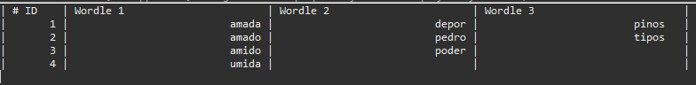

# Word list filter library

Find the match word from a word list according using filters.

## References

### Dictionaries

- Portuguese language
	1. [Lista de todas as palavras do português brasileiro](https://www.ime.usp.br/~pf/dicios/br-utf8.txt).

- English language
	1. [An English Word List](https://www-personal.umich.edu/~jlawler/wordlist.html).
	1  [The word list file](https://www-personal.umich.edu/~jlawler/wordlist).

### Regular expressions usage

- [Java regular expressions](https://www.vogella.com/tutorials/JavaRegularExpressions/article.html).

### Troubleshoots solutions

In case of troubleshoots check these videos out for trying to solve the error

- JUnit5 errors
	1. [JUnit 5 Basics 7 - Creating a JUnit test](https://www.youtube.com/watch?v=EROuIf2Ac_I&list=PLqq-6Pq4lTTa4ad5JISViSb2FVG8Vwa4o&index=7).
	1. [4. JUnit5 Basics - Test Annotation in JUnit5 | JUnit5 Test Annotation | What is @Test Annotation](https://www.youtube.com/watch?v=zK6bVOhrxrc).

## Description

### Screenshot



<!--
## Installation setup

???
-->

## Usage

### Build Wordle object with custom arguments

- Arguments

|Primitive type	|Variable
|---			|---
|boolean		|accentuation
|int			|wordLengthMinimum
|int			|wordLengthMaximum
|String			|wordDictionaryLanguage
|String			|wordContent
|String			|wordNotContent
|char[]			|wordFinal

### Examples

- Syntax
	> `wordles.add(new Wordle(accentuation, wordLengthMinimum, wordLengthMaximum, wordDictionaryLanguage, wordContent, wordNotContent, wordFinal));`

- Search words whose have 'p', 'o', 'e', 'r' and 'd' characters ignoring aaaa with word length equals to 5.
	> `wordles.add(new Wordle(false, 5, 5, dictionaryUrl, "poerd", "", "?????".toCharArray()));`

- Search words whose have 'o', 'i' and 'p' characters but do not have 'a', 'u', 'r', 'c', 'l', 'v', 'g', 'm' characters ignoring accentuation.
	> `wordles.add(new Wordle(false, 5, 5, dictionaryUrl, "oip", "aureclvgm", "????s".toCharArray()));`

- Search words whose have 'a' character and the characters positions are  '?', 'm', '?', 'd', '?' ignoring accentuation. '?' means unknown character.
	> `wordles.add(new Wordle(false, 5, 5, dictionaryUrl, "a", "", "?m?d?".toCharArray()));`

### Template

- ???

```java
package com.henrikbeck95.swordle;

import java.util.ArrayList;

import com.henrikbeck95.wordlist.Wordlist;
import com.henrikbeck95.wordlist.wordle.Wordle;

public class App {
	public static void main(String[] args) {
		ArrayList<Wordle> wordles = new ArrayList<Wordle>();
		
		String dictionaryUrl = Wordlist.getResourcePath("portuguese");
		// System.out.println(dictionaryUrl);

		// Insert Wordle elements into ArrayList
		wordles.add(new Wordle(false, 5, 7, dictionaryUrl, "", "", "?????".toCharArray()));
		
		// Wordlist.displayAllWordleSizes(wordles);
		Wordlist.displayAllWordleValues(wordles);
	}
}
```